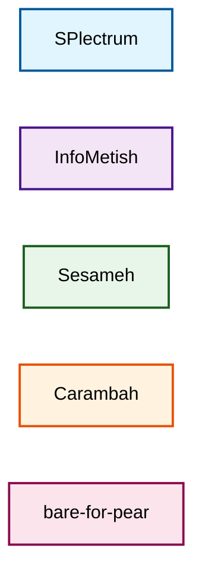
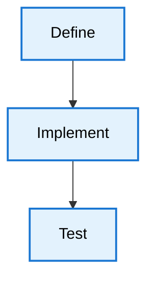
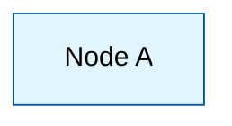

# Visual Documentation Guide

This guide provides operational standards for creating visual documentation in the SPlectrum repository.

## Visual Tools

### Primary: Mermaid Diagrams
- GitHub renders these natively
- Interactive in some viewers
- Preferred for architecture, flows, and relationships

### Secondary: ASCII Art
- Markdown native, portable
- Good for simple diagrams
- Works everywhere

### Example Event Flow (ASCII)
```
Repo A          Repo B          Repo C
  │               │               │
  ├──[event]─────▶│               │
  │               ├──[process]───▶│
  │               │               ├──[event]──▶
  │               │◀──[response]──┤
  │◀──[complete]──┤               │
```

## Organization Color Palette

Each organization has a designated color for visual consistency:



### Organization Colors
- **SPlectrum** (Engine): Light blue - `#e1f5fe` (clarity, flow)
- **InfoMetish** (Packaging): Light purple - `#f3e5f5` (transformation)
- **Sesameh** (AI): Light green - `#e8f5e9` (intelligence, growth)
- **Carambah** (Composition): Light orange - `#fff3e0` (creativity, energy)
- **bare-for-pear** (P2P): Light pink - `#fce4ec` (connection)

## Process Flow Colors

Standardized colors for different process stages:

- **Input/Request**: Blue - `#bbdefb`
- **Decision/AI**: Green - `#c8e6c9`
- **Action/Test**: Orange - `#ffe0b2`
- **Implementation**: Pink - `#f8bbd0`
- **Validation**: Purple - `#d1c4e9`
- **Success/Deploy**: Teal - `#b2dfdb`

## Mermaid Usage Patterns

### Class Definition Method


### Direct Style Method


## Best Practices

1. **Consistency**: Use the same visual style throughout a document
2. **Clarity**: Simple diagrams are better than complex ones
3. **Context**: Always provide a brief text explanation with diagrams
4. **Accessibility**: Include text descriptions for screen readers
5. **Version Control**: Prefer text-based formats (Mermaid, ASCII) over binary images

## Examples in Use

See the following documents for visual documentation examples:
- `docs/preliminary/visual-examples.md` - Various diagram types
- `docs/preliminary/inbox-outbox-pattern.md` - Event flow diagrams
- `docs/preliminary/single-concern-repositories.md` - Repository relationship diagrams