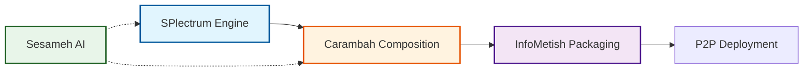

# Getting Started with SPlectrum

This guide helps you quickly understand and start working with the SPlectrum ecosystem.

## Understanding the Ecosystem

SPlectrum is a multi-organization ecosystem for building P2P-native applications:

## Core Concepts

### 1. Everything is a Stream
- Applications process streams of events
- Events are immutable AVRO records
- Choreography through inbox/outbox patterns

### 2. Unified App/Module Architecture
- Modules are just stateless apps
- Apps can use other apps as modules
- No artificial distinction between apps and libraries

### 3. AI-First Development
- Collaborate with AI to create solutions
- AI handles implementation details
- You focus on what to build, not how

## First Steps

1. **Explore the Architecture**: Read the [unified app/module model](../architecture/core-patterns/unified-app-module.md)
2. **Understand Events**: Learn about [event choreography](../architecture/core-patterns/event-choreography.md)
3. **See Bootstrapping**: Check [implementation strategy](../implementation/bootstrapping/splectrum-evolution.md)

## Next: Create Your First App

Continue to [Creating Apps](./creating-apps.md) to build your first SPlectrum application.