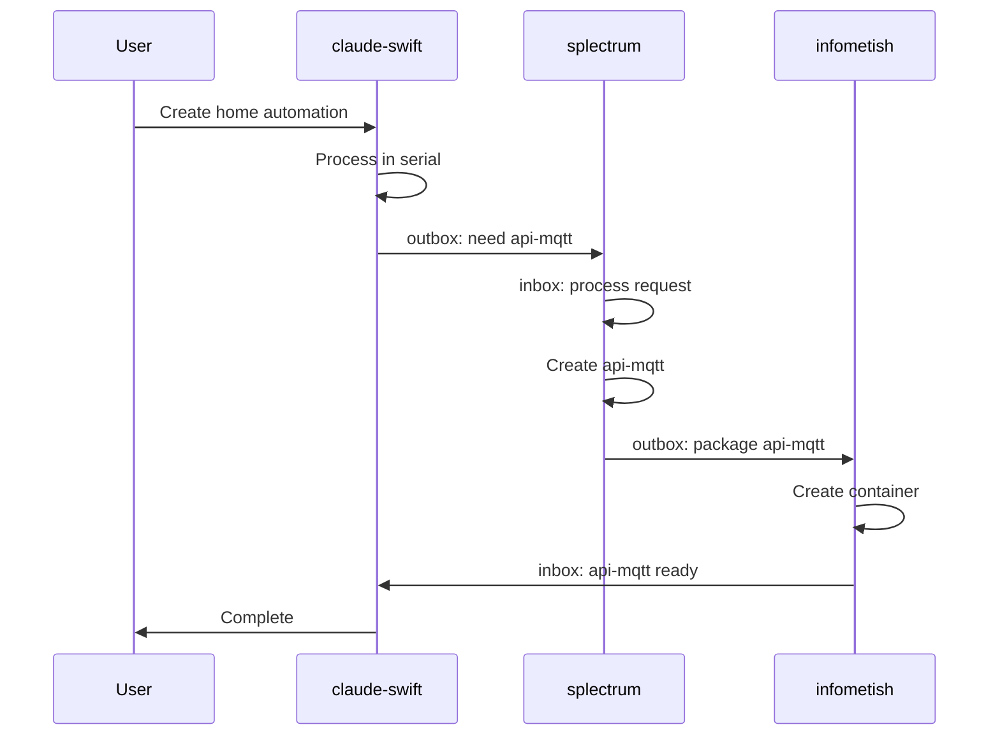
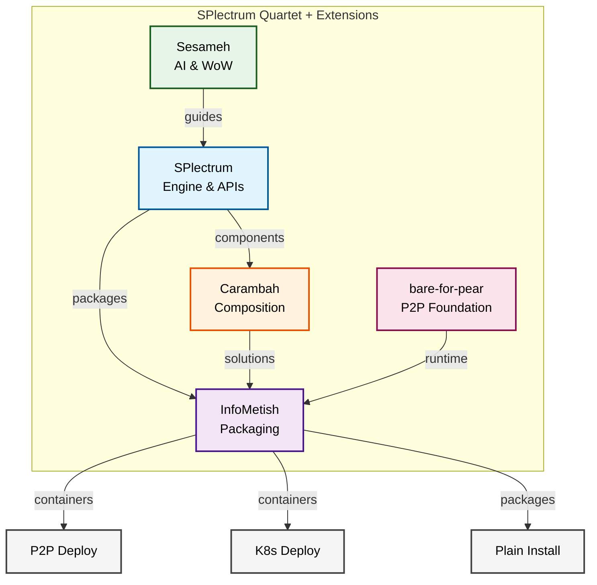
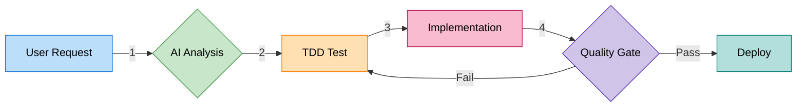
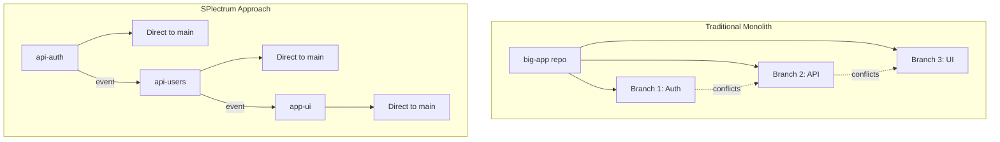

# Visual Documentation Examples

## Event-Driven Choreography

### Mermaid Sequence Diagram


### Component Overview


### Colorful Flow Diagram


### ASCII Alternative
```
User     claude-swift     splectrum      infometish
 │            │              │              │
 ├─request───▶│              │              │
 │            ├──process────▶              │
 │            ├──outbox─────▶              │
 │            │              ├──create────▶│
 │            │              ├──outbox─────▶
 │            │              │              ├──package─▶
 │            │◀───inbox─────────────────┤
 │◀──complete──┤              │              │
```

## Repository Single Concern

### Mermaid Graph


## TDD Quality Gates

### Simple Flow
```
┌───────────────────┐
│  Write Test First │
└────────┬─────────┘
         │
         ▼
┌───────────────────┐     ┌─────────────────┐
│    Test Fails     │────▶│  Implement Code │
└───────────────────┘     └───────┬────────┘
                                     │
                                     ▼
                            ┌─────────────────┐
                            │   Test Passes   │
                            │  ✓ Quality Gate │
                            └───────┬────────┘
                                     │
                                     ▼
                            ┌─────────────────┐
                            │  Commit to Main │
                            └─────────────────┘
```