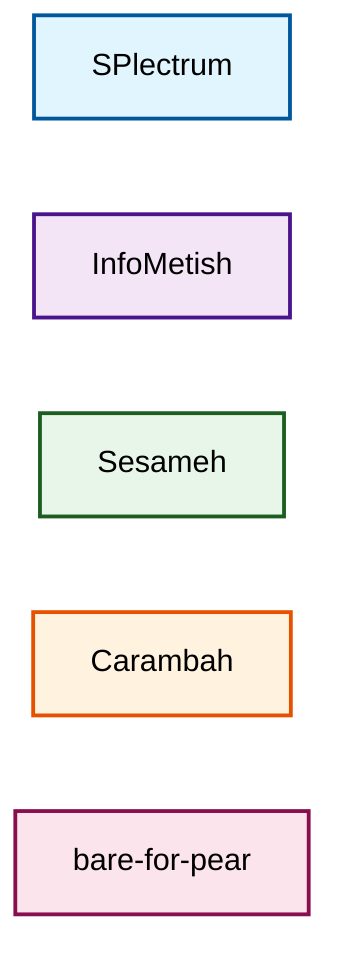

# Visual Style Guide

## Color Palette for Organizations

### Mermaid Color Definitions


## Organization Colors
- **SPlectrum** (Engine): Light blue - `#e1f5fe` (clarity, flow)
- **InfoMetish** (Packaging): Light purple - `#f3e5f5` (transformation)
- **Sesameh** (AI): Light green - `#e8f5e9` (intelligence, growth)
- **Carambah** (Composition): Light orange - `#fff3e0` (creativity, energy)
- **bare-for-pear** (P2P): Light pink - `#fce4ec` (connection)

## Process Flow Colors
- **Input/Request**: Blue - `#bbdefb`
- **Decision/AI**: Green - `#c8e6c9`
- **Action/Test**: Orange - `#ffe0b2`
- **Implementation**: Pink - `#f8bbd0`
- **Validation**: Purple - `#d1c4e9`
- **Success/Deploy**: Teal - `#b2dfdb`

## Using Colors

### Class Definition Method
```
%%% In your mermaid diagram:
graph TD
    A[Node A]
    B[Node B]
    
    %% Define styles
    classDef styleNameHere fill:#colorHere,stroke:#borderHere,stroke-width:2px,color:#000
    
    %% Apply to nodes
    class A,B styleNameHere
```

### Direct Style Method
```
%%% In your mermaid diagram:
graph TD
    A[Node A]
    
    %% Apply style directly
    style A fill:#colorHere,stroke:#borderHere,color:#000
```

### Example Usage
